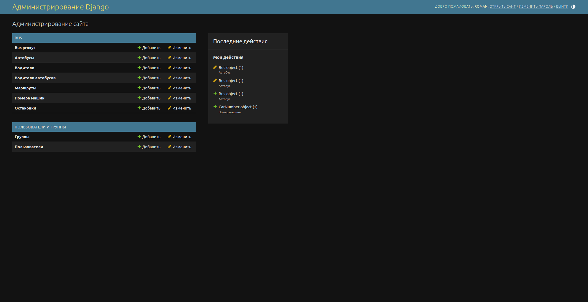
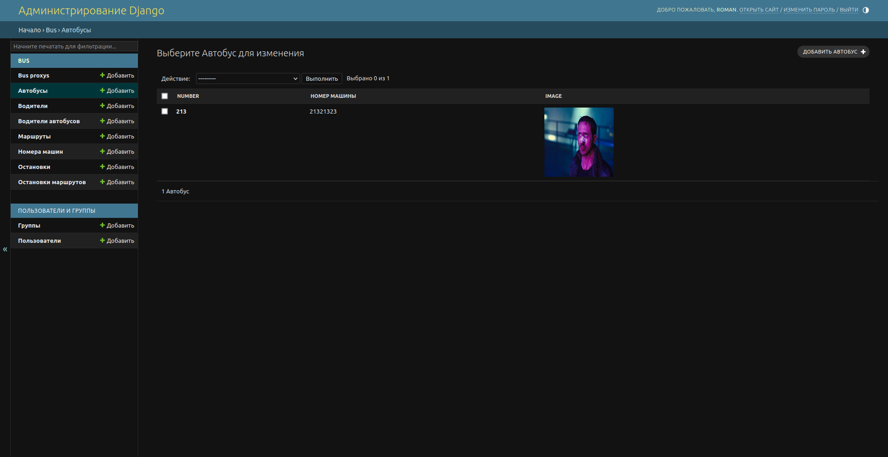

# Bus Tracker

Bus Tracker - это веб-приложение, разработанное на Django, которое позволяет отслеживать автобусы в реальном времени. Оно использует модели данных для автобусов, водителей и маршрутов, а также предоставляет интерфейс администратора для управления этими данными.

## Установка

1. Клонируйте репозиторий: `git clone https://github.com/yourusername/bus_tracker.git`
2. Перейдите в директорию проекта: `cd bus_tracker`
3. Установите зависимости: `pip install -r requirements.txt`
4. Примените миграции: `python manage.py migrate`
5. Запустите сервер разработки: `python manage.py runserver`

Теперь вы можете открыть веб-браузер и перейти по адресу `http://localhost:8000` для доступа к приложению.

## Скриншоты

Вот несколько скриншотов нашего приложения:

## Лицензия

Bus Tracker лицензирован под лицензией MIT. См. файл `LICENSE` для дополнительной информации.